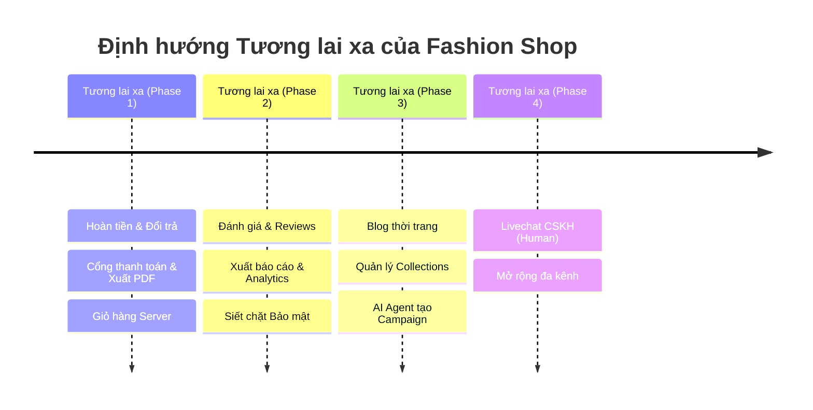

# Lộ Trình Định Hướng Tương Lai Xa (Long-Term Future Vision) — Fashion Shop

> [!IMPORTANT]
> **ĐÍNH CHÍNH QUAN TRỌNG:**
> Đây là danh sách tổng hợp các ý tưởng, tính năng và định hướng cho **TƯƠNG LAI XA (Long-term Backlog)** của dự án, **HOÀN TOÀN KHÔNG PHẢI kế hoạch triển khai ở thời điểm hiện tại**.
> 
> Giai đoạn hiện tại tập trung vào hoàn thiện các chức năng nền tảng cốt lõi của Fashion Shop. Các hạng mục dưới đây chỉ mang tính chất lưu trữ định hướng tham khảo để đội ngũ phát triển không bỏ quên ý tưởng khi hệ thống đạt quy mô lớn hơn trong tương lai.

---

## 🎯 Tổng quan Định hướng Dài hạn (Future Horizons)

---

## 📋 Chi tiết các Hạng mục Tính năng

### 1. Luồng Hoàn tiền & Quy trình Đổi / Trả hàng (Refunds & Returns)
- **Hoàn tiền tự động / bán tự động:**
  - Xử lý hoàn tiền khi khách hàng hủy đơn hàng (trước khi vận chuyển) hoặc khi giao dịch thanh toán trực tuyến phát sinh lỗi.
  - Tích hợp API hoàn tiền của cổng thanh toán (Stripe / VietQR / VNPAY) hoặc hoàn về số dư ví / tài khoản ngân hàng của khách.
- **Quy trình Đổi / Trả hàng (Returns & Exchanges):**
  - Khách hàng tạo yêu cầu đổi size / trả hàng kèm lý do, mô tả và hình ảnh/video sản phẩm lỗi.
  - Trạng thái yêu cầu: `Chờ duyệt` ➔ `Đã nhận hàng trả` ➔ `Kiểm hàng đạt chuẩn` ➔ `Đổi hàng mới / Hoàn tiền`.
  - Tự động hoàn lại số lượng tồn kho (restock) theo trạng thái thực tế của sản phẩm.

### 2. Xuất Hóa đơn Điện tử (PDF) & Cổng Thanh toán Chính thức
- **Hóa đơn điện tử PDF:**
  - Sinh file PDF hóa đơn chuyên nghiệp theo nhận diện thương hiệu Fashion Shop (sử dụng `@react-pdf/renderer` hoặc Puppeteer/PDFKit).
  - Khách hàng có thể tải trực tiếp từ trang Lịch sử đơn hàng (`/orders`) hoặc tự động gửi đính kèm email xác nhận đơn.
- **Tích hợp Cổng thanh toán chính thức (Production Gateway):**
  - Kết nối cổng thanh toán chính thức (VNPAY, MoMo, Stripe Production, PayOS).
  - Webhook đối soát giao dịch thời gian thực (reconciliation) với chữ ký số bảo mật (HMAC SHA512).

### 3. Đánh giá & Phản hồi từ Khách hàng (Product Reviews & Ratings)
- **Đánh giá sản phẩm:**
  - Chấm điểm sao (1 đến 5 sao), viết nhận xét chi tiết, upload ảnh thực tế khi mặc đồ.
  - **Verified Purchase**: Chỉ cho phép đánh giá những sản phẩm thuộc đơn hàng có trạng thái `Đã giao thành công`.
- **Tương tác cộng đồng:**
  - Nút Like / Hữu ích (helpful count) cho từng đánh giá để đẩy nhận xét chất lượng lên đầu.
- **Phản hồi từ Shop:**
  - Nhân viên/Admin có quyền gửi **1 phản hồi chính thức (Staff Reply)** dưới mỗi đánh giá của khách để giải đáp hoặc cảm ơn.

### 4. Xuất Báo cáo & Phân tích Chuyên sâu (Advanced Analytics & Reporting)
- **Xuất dữ liệu linh hoạt:**
  - Xuất báo cáo doanh thu, lợi nhuận, chi phí nhập hàng, tồn kho và danh sách đơn hàng ra định dạng Excel (XLSX), CSV và PDF.
- **Module Phân tích (BI & Analytics):**
  - Phân tích xu hướng thời trang theo danh mục, size và màu sắc bán chạy.
  - Tín hiệu tồn kho (Inventory Turnover, Dead Stock, Low Stock Alerts).
  - Tỷ lệ hoàn đơn, hủy đơn theo khu vực và kênh thanh toán.

### 5. Giỏ hàng Lưu trữ trên Server (Server-side Synced Cart)
- **Đồng bộ đa thiết bị:**
  - Chuyển đổi giỏ hàng từ LocalStorage sang lưu trữ đồng bộ trên Server (PostgreSQL / Redis) cho tài khoản đã đăng nhập.
  - Tự động gộp giỏ hàng (Cart Merge): Khi khách hàng thêm đồ dạng khách vãng lai (Guest) rồi đăng nhập, hệ thống tự động gộp vào giỏ hàng tài khoản mà không làm mất sản phẩm.
  - Giữ chỗ tồn kho tạm thời (Inventory Reservation) trong thời gian thanh toán.

### 6. Siết chặt Bảo mật Hệ thống (Security Hardening)
- **Bảo vệ API & Hạ tầng:**
  - Triển khai Rate Limiting thông minh (NestJS Throttler + Redis) chống tấn công DoS và spam request.
  - Bảo vệ chống Brute-force đăng nhập (khóa tài khoản tạm thời sau nhiều lần thất bại, CAPTCHA).
  - Cấu hình Helmet Security Headers, CORS nghiêm ngặt, chống CSRF cho các route quan trọng.
- **Quản lý Quyền hạn & Giám sát:**
  - Phân quyền RBAC nâng cao (Admin, Quản lý kho, Nhân viên CSKH, Biên tập viên).
  - Audit Logging ghi lại mọi thao tác nhạy cảm (thay đổi giá sản phẩm, xóa voucher, cập nhật trạng thái đơn, thao tác tiền tệ).
  - Input sanitization và validation nghiêm ngặt chống XSS và Injection.

### 7. Tạo Blog Quảng bá Thời trang (Editorial & Fashion Blog)
- **Hệ thống Quản lý Bài viết (CMS Blog):**
  - Trình soạn thảo văn bản phong phú (Rich Text / Markdown), tải nhiều ảnh, quản lý danh mục bài viết, tác giả và tag.
  - Tối ưu SEO on-page: Thẻ Meta title, description, OpenGraph preview, Schema.org article markup.
- **Gắn link mua sắm trực tiếp (Shoppable Articles):**
  - Chèn widget sản phẩm hoặc bộ sưu tập ngay trong nội dung bài viết ("Mua ngay trang phục trong bài") nhằm tối đa hóa tỷ lệ chuyển đổi.

### 8. Quản lý Bộ sưu tập (Collections & Lookbook — Tương lai)
- **Bộ sưu tập thời trang:**
  - Quản lý nhóm sản phẩm theo mùa / chủ đề (Xuân Hè 2026, Thu Đông, Tiệc Tùng, Đồ Công Sở Thanh Lịch, Đồ Đi Biển...).
  - Trang Lookbook tương tác trực quan (ảnh phối đồ cả set kèm popup thông tin từng món đồ).
  - Đặt lịch tự động ra mắt hoặc kết thúc Bộ sưu tập.

### 9. AI Agent Hỗ trợ Admin Tạo Chiến dịch (AI Marketing Campaign Assistant)
- **Trợ lý AI chuyên biệt cho Admin:**
  - Đề xuất ý tưởng chiến dịch marketing dựa trên mùa vụ, ngày lễ và dữ liệu hàng tồn kho thực tế.
  - Tự động soạn thảo nội dung tiêu đề, mô tả khuyến mãi, banner copywriting.
  - Đề xuất quy tắc giảm giá tối ưu (giảm %, giảm giá cố định, mua kèm giảm giá) và tự động tạo Campaign / Voucher chỉ bằng một câu lệnh prompt của admin.

### 10. Chat Hỗ trợ Khách hàng Trực tiếp (Human Staff Livechat — P4 / Chưa cần gấp)
- **Hệ thống Livechat thời gian thực:**
  - Kết nối giữa nhân viên CSKH (con người) và khách hàng qua WebSocket.
  - Chuyển tiếp mượt mà từ AI Chatbot sang nhân viên tư vấn khi AI không thể giải quyết hoặc khách yêu cầu gặp tổng đài viên.
  - Giao diện console quản lý hàng đợi tin nhắn dành cho đội ngũ CSKH.

---

## 📊 Ma trận Ưu tiên (Prioritization Matrix)

| Hạng mục | Độ ưu tiên | Mức độ phức tạp | Tác động kinh doanh |
| :--- | :---: | :---: | :---: |
| **Hoàn tiền & Đổi/Trả hàng** | 🔴 Cao (P1) | Trung bình | Tăng niềm tin mua sắm của khách |
| **Cổng thanh toán & Xuất hóa đơn PDF** | 🔴 Cao (P1) | Trung bình | Hoàn thiện luồng thanh toán pháp lý |
| **Giỏ hàng Server-side** | 🟡 Trung bình (P2) | Thấp - TB | Trải nghiệm mua sắm mượt mà |
| **Đánh giá & Review sản phẩm** | 🟡 Trung bình (P2) | Trung bình | Tăng bằng chứng xã hội (Social Proof) |
| **Xuất báo cáo & Module phân tích** | 🟡 Trung bình (P2) | Trung bình | Hỗ trợ ra quyết định kinh doanh |
| **Siết chặt Bảo mật** | 🟡 Trung bình (P2) | Trung bình | Bảo vệ dữ liệu và hệ thống |
| **Blog quảng bá thời trang** | 🟢 Thấp (P3) | Thấp - TB | Tăng traffic SEO tự nhiên |
| **Quản lý Bộ sưu tập (Collections)** | 🟢 Thấp (P3) | Trung bình | Nâng cao hình ảnh thương hiệu |
| **AI Agent tạo Campaign cho Admin** | 🟢 Thấp (P3) | Cao | Tự động hóa vận hành marketing |
| **Livechat CSKH (Human)** | ⚪ P4 (Sau cùng) | Cao | Hỗ trợ chuyên sâu khi quy mô lớn |

---

## 📌 Hướng dẫn Cập nhật & Theo dõi

- Mỗi khi bắt đầu thực hiện một tính năng trong lộ trình, tạo branch theo chuẩn: `feature/be-<name>` hoặc `feature/fe-<name>`.
- Đánh dấu trạng thái `[x]` và liên kết tới tài liệu thiết kế hoặc PR tương ứng trong tài liệu này.
