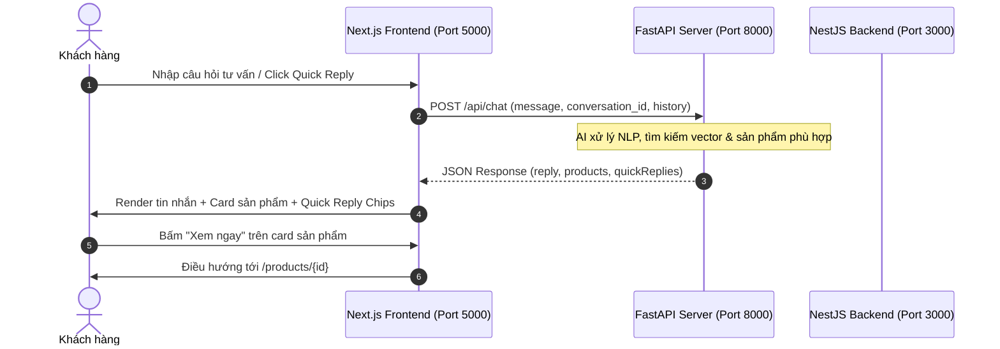

# Hướng Dẫn Tích Hợp Chatbot AI (FastAPI & Next.js Frontend)

Tài liệu này quy định chuẩn giao tiếp (API Contract) và định dạng dữ liệu giữa **Frontend Fashion Shop** (`fashion-shop-fe`) và **AI Agent Server (FastAPI)** phục vụ tính năng Chatbot AI Stylist tư vấn sản phẩm.

---

## 1. Kiến trúc Tổng quan



---

## 2. Cấu hình Môi trường

Thêm biến môi trường vào `fashion-shop-fe/.env` (hoặc `.env.local`):

```env
# URL trỏ tới máy chủ AI Agent FastAPI
NEXT_PUBLIC_AI_CHATBOT_URL=http://localhost:8000
```

> **Lưu ý:** Khi server FastAPI chưa chạy hoặc mất kết nối, Frontend được tích hợp sẵn cơ chế **Mock Stylist Engine** thông minh để tự động phản hồi dự phòng kèm dữ liệu sản phẩm, không làm gián đoạn trải nghiệm người dùng.

---

## 3. Quy chuẩn API Contract

### Endpoint
- **Method:** `POST`
- **Path:** `/api/chat` (hoặc `/chat`)
- **Headers:** `Content-Type: application/json`

---

### Request Payload (Client -> FastAPI)

```json
{
  "message": "Tôi muốn tìm áo sơ mi nam đi làm thanh lịch",
  "conversation_id": "conv-1712345678-abcde",
  "history": [
    {
      "role": "user",
      "content": "Xin chào"
    },
    {
      "role": "assistant",
      "content": "Chào bạn! Mình có thể giúp gì cho bạn hôm nay?"
    }
  ]
}
```

#### Chi tiết trường:
| Trường | Kiểu | Bắt buộc | Mô tả |
| :--- | :--- | :---: | :--- |
| `message` | `string` | **Có** | Nội dung câu hỏi hiện tại của khách hàng. |
| `conversation_id` | `string` | **Có** | Mã định danh phiên hội thoại (do FE sinh và lưu trữ qua Zustand persist). |
| `history` | `array` | Không | Lịch sử tối đa 6 lượt chat gần nhất để AI duy trì ngữ cảnh. |

---

### Response Payload (FastAPI -> Client)

```json
{
  "reply": "Chào bạn! Để đi làm thanh lịch và chỉn chu, các dòng sơ mi **chất liệu sợi tre và Oxford chống nhăn** là lựa chọn hàng đầu.\n\n• **Chất liệu thoáng mát**: Thích hợp cho cả ngày làm việc công sở\n• **Form dáng Regular Fit**: Thoải mái, tôn dáng tự nhiên\n\nDưới đây là một số mẫu sơ mi bán chạy nhất:",
  "conversation_id": "conv-1712345678-abcde",
  "products": [
    {
      "id": 1,
      "name": "Áo Sơ Mi Nam Oxford Regular Fit",
      "price": 389000,
      "originalPrice": 489000,
      "discountPercent": 20,
      "imageUrl": "https://images.unsplash.com/photo-1596755094514-f87e34085b2c?w=400&q=80",
      "category": "Áo sơ mi",
      "brand": "Fashion Shop Men"
    },
    {
      "id": 2,
      "name": "Áo Polo Nam Pique Cotton Cao Cấp",
      "price": 299000,
      "originalPrice": 399000,
      "discountPercent": 25,
      "imageUrl": "https://images.unsplash.com/photo-1583743814966-8936f5b7be1a?w=400&q=80",
      "category": "Áo polo",
      "brand": "Urban Classic"
    }
  ],
  "quickReplies": [
    "Tư vấn chọn size sơ mi",
    "Có màu trắng hoặc xanh pastel?",
    "Gợi ý quần âu phối cùng"
  ]
}
```

#### Chi tiết trường Response:
| Trường | Kiểu | Bắt buộc | Hiển thị trên UI Frontend |
| :--- | :--- | :---: | :--- |
| `reply` | `string` | **Có** | Bong bóng tin nhắn AI Stylist. Hỗ trợ định dạng văn bản Markdown. |
| `conversation_id` | `string` | Không | Đồng bộ ID phiên hội thoại. |
| `products` | `array` | Không | Hiển thị dạng **dải Card sản phẩm trượt ngang** (ảnh tỉ lệ 3:4, nhãn giảm giá, giá bán định dạng VND, nút *Xem ngay*). |
| `quickReplies` | `string[]` | Không | Các nút bấm gợi ý câu hỏi tiếp theo (chips có icon lấp lánh). |

---

## 4. Quy tắc Định dạng Nội dung `reply`

Để tin nhắn hiển thị đẹp, rõ ràng và chuẩn phong cách Stylist thời trang, chuỗi `reply` nên áp dụng các quy ước sau:

1. **In đậm điểm nhấn (`**...**`)**:
   - Cú pháp: `**Nội dung in đậm**`
   - Hiệu ứng: Chữ đen đậm nét `font-semibold text-gray-900`.
   - Ví dụ: `Áo chất liệu **Cotton 100%** co giãn tốt.`
2. **Gạch đầu dòng danh sách (`• ` hoặc `- `)**:
   - Cú pháp: Đặt ký tự `•` hoặc `-` ở đầu dòng.
   - Hiệu ứng: Render tự động bullet tròn màu hồng rose sang trọng, căn dòng thụt lề chuẩn.
   - Ví dụ:
     ```text
     • **Size M**: 54 - 62 kg | 1m60 - 1m68
     • **Size L**: 63 - 72 kg | 1m68 - 1m75
     ```
3. **Phân tách đoạn (`\n\n`)**:
   - Dùng 2 dấu xuống dòng để ngắt đoạn, tạo khoảng trắng thoáng đãng dễ đọc.

---

## 5. Quy cách Dữ liệu Sản phẩm (`products`)

Mỗi object trong mảng `products` cần các thuộc tính:

```typescript
export interface ChatRecommendedProduct {
  id: number;              // ID sản phẩm trong DB (để tạo link /products/{id})
  name: string;            // Tên sản phẩm
  price: number;           // Giá bán hiện tại (VND)
  originalPrice?: number;  // Giá gốc trước khi giảm (tùy chọn)
  discountPercent?: number;// % giảm giá (ví dụ: 20 -> hiển thị badge -20%)
  imageUrl?: string;       // Link ảnh sản phẩm (tỉ lệ 3:4 tối ưu)
  category?: string;       // Tên danh mục (ví dụ: "Áo sơ mi", "Đầm tiệc")
  brand?: string;          // Thương hiệu sản phẩm
}
```

---

## 6. Code Mẫu Backend FastAPI (Python)

Dưới đây là mã nguồn mẫu bạn có thể tích hợp trực tiếp vào dự án FastAPI:

```python
from typing import List, Optional
from fastapi import FastAPI
from fastapi.middleware.cors import CORSMiddleware
from pydantic import BaseModel

app = FastAPI(title="Fashion Shop AI Stylist Agent")

# Cấu hình CORS để Next.js (port 5000) có thể gọi trực tiếp
app.add_middleware(
    CORSMiddleware,
    allow_origins=["http://localhost:5000", "http://127.0.0.1:5000"],
    allow_credentials=True,
    allow_methods=["*"],
    allow_headers=["*"],
)

class HistoryMessage(BaseModel):
    role: str
    content: str

class ChatRequest(BaseModel):
    message: str
    conversation_id: str
    history: Optional[List[HistoryMessage]] = []

class RecommendedProduct(BaseModel):
    id: int
    name: str
    price: float
    originalPrice: Optional[float] = None
    discountPercent: Optional[int] = None
    imageUrl: Optional[str] = None
    category: Optional[str] = None
    brand: Optional[str] = None

class ChatResponse(BaseModel):
    reply: str
    conversation_id: Optional[str] = None
    products: Optional[List[RecommendedProduct]] = []
    quickReplies: Optional[List[str]] = []

@app.post("/api/chat", response_model=ChatResponse)
async def chat_endpoint(payload: ChatRequest):
    # TODO: Gọi LLM (OpenAI / Gemini / Llama / LangChain / RAG) xử lý tại đây
    user_query = payload.message.lower()

    # Dữ liệu mẫu trả về
    return ChatResponse(
        reply="Mình gợi ý cho bạn một số mẫu sơ mi **Oxford cao cấp** chống nhăn phù hợp đi làm:\n\n• **Chất vải**: Thoáng mát, co giãn nhẹ\n• **Bảo hành**: Hỗ trợ đổi size trong 7 ngày",
        conversation_id=payload.conversation_id,
        products=[
            RecommendedProduct(
                id=1,
                name="Áo Sơ Mi Nam Oxford Regular Fit",
                price=389000,
                originalPrice=489000,
                discountPercent=20,
                imageUrl="https://images.unsplash.com/photo-1596755094514-f87e34085b2c?w=400&q=80",
                category="Áo sơ mi",
                brand="Fashion Shop Men"
            )
        ],
        quickReplies=[
            "Tư vấn bảng size chi tiết",
            "Có mẫu màu xanh pastel không?",
            "Gợi ý quần phối cùng"
        ]
    )
```

---

## 7. Cấu trúc Component trên Frontend

Các file liên quan đến Chatbot trên Frontend:
- `fashion-shop-fe/src/types/chatbot.ts`: Định nghĩa Interface TypeScript.
- `fashion-shop-fe/src/services/chatbot.service.ts`: Service giao tiếp API và engine mock dự phòng.
- `fashion-shop-fe/src/stores/chatbot.store.ts`: Zustand store quản lý trạng thái, lịch sử tin nhắn và persistence.
- `fashion-shop-fe/src/components/chatbot/`:
  - `ChatWidget.tsx`: Entrypoint gắn tại layout.
  - `ChatTriggerButton.tsx`: Nút tròn nổi mở chatbox kèm badge và tooltip.
  - `ChatWindow.tsx`: Cửa sổ chatbox chính.
  - `ChatMessageItem.tsx`: Hiển thị tin nhắn, parse markdown và strip card sản phẩm.
  - `ChatProductCard.tsx`: Card hiển thị sản phẩm thu nhỏ.
  - `ChatQuickReplies.tsx`: Danh sách câu hỏi gợi ý nhanh.
  - `ChatInput.tsx`: Ô nhập tin nhắn.
